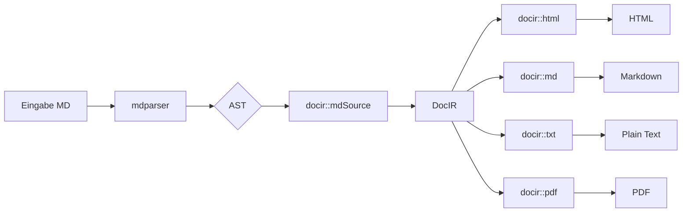

# Markdown Extensions Demo

Demonstration aller in mdstack v0.2.10 + docir 2026-05-16 hinzugekommenen
Features. Beim Parsen entstehen folgende AST-Node-Typen.

Setext-Heading H1
=================

So wird ein H1 mit Setext-Syntax (Underline statt `#`-Prefix) geschrieben.
Vor allem für lange Titel lesbar.

Setext-Heading H2
-----------------

Das `---` unter Text macht H2. Außerhalb dieser Position bleibt `---` ein
**Horizontal Rule** — zum Beispiel hier:

---

## ATX-Headings funktionieren weiterhin

Für H3-H6 ist ATX (`###` etc.) sowieso die einzige Variante. Die
Setext-Syntax beschränkt sich auf H1 und H2.

## Inline-Math mit Pandoc-Syntax

Die berühmte Formel lautet $E = mc^2$ und stammt von Einstein. Ein
quadratischer Ausdruck wie $ax^2 + bx + c = 0$ ist die Standard-Form.

Bei Preisen wie $5 oder $10 schaltet der Parser nicht in den Math-Modus —
das ist intentional. Die Erkennung verlangt, dass nach dem öffnenden `$`
kein Leerzeichen und keine Ziffer kommt.

## Display-Math als Block

Quadratische Lösungsformel:

$$
x = \frac{-b \pm \sqrt{b^2 - 4ac}}{2a}
$$

Auch einzeilig möglich: $$y = mx + b$$

## Mermaid-Diagramme



Im HTML-Output mit `enableMermaid=1` wird daraus ein gerendertes
Flowchart-Diagramm. In MD/TXT/PDF-Output bleibt es ein Code-Block mit
`language=mermaid`-Markierung — Konsumenten können es bei Bedarf
weiterverarbeiten.

## GFM-Features (zum Vergleich, schon vorher da)

Task-Listen:

- [x] Setext-Headings implementieren
- [x] Inline-Math `$...$`
- [x] Display-Math `$$...$$`
- [x] Mermaid-CSS-Class im HTML-Renderer
- [x] Plain-Text-Senke
- [x] n2md CLI
- [ ] mdhelp-App auf neue Features anpassen
- [ ] Demo schreiben (du liest sie gerade)

Strikethrough: ~~veraltete Idee~~ → neue Variante.

Autolink: <https://example.com> wird zum klickbaren Link.

## Tabellen + Code

| Feature | Parser | docir::md | docir::html | docir::txt |
|---------|--------|-----------|-------------|------------|
| ATX-Heading | ✓ | ✓ | ✓ | ✓ |
| Setext-Heading | ✓ (v0.2.10) | via level | via level | via level |
| Inline-Math | ✓ (v0.2.10) | `$...$` | `<span>` | inline text |
| Display-Math | ✓ (v0.2.10) | `$$...$$` | `<div>` | `$$...$$` |
| Mermaid-CB | ✓ (lang-Tag) | ` ```mermaid ` | `<pre class="mermaid">` | indented |

Code-Block mit Sprach-Tag:

```tcl
package require mdstack::parser
set ast [mdstack::parser::parse $markdown]
puts [dict get $ast blocks]
```

## Pandoc Divs (Custom Containers)

::: {.warning}
Das ist eine Warnungs-Box. Im HTML-Output wird daraus
`<div class="warning">`, in MD bleibt's `:::warning ... :::`.
:::

::: {.tip}
Tip-Container — gleiches Muster, andere Klasse.
:::

## Footnotes

Eine Behauptung mit Quelle.[^1]

[^1]: Die Fußnote landet am Ende des Dokuments, automatisch nummeriert.

## Ende

Damit sind alle in dieser Session hinzugekommenen Features in einem
Dokument zu sehen.
